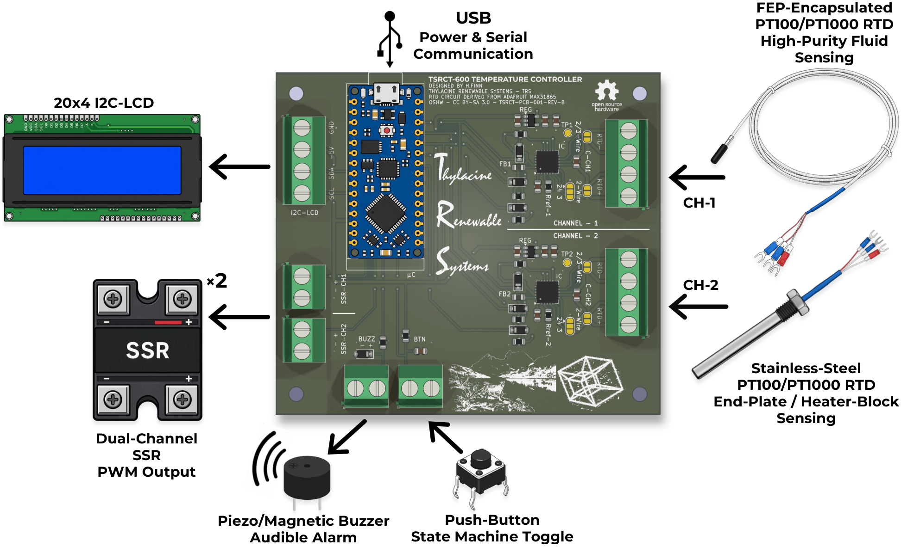

# An Open-Source Dual-Channel RTD Thermal-Control Platform for Research-Scale PEM Water Electrolysis Balance-of-Plant Integration

**TSRCT-PCB-01** is an Arduino Nano Every–based temperature-control board for experimental thermal management. It connects two Pt100 or Pt1000 resistance temperature detectors (RTDs) to independent **5 V digital solid-state-relay (SSR) control outputs**, with controller power and host communication through a single USB connection. External SSRs switch a separately powered heater circuit.

**Repository release: v1.1.1 | Firmware and Python tools: V1.1**

[Setup and dependencies](DEPENDENCIES.md) · [Release notes](RELEASE-NOTES.md) · [Citation](CITATION.cff) · [Licensing](LICENSE.md)

The accompanying manuscript describes the circuit, analytical tuning methods, experimental results, and operating scope. The reported experiments characterise temperature control on isolated, dry electrolysis-cell end plates.

## Ordering assembled boards

Assembled boards (PCB fabrication, component sourcing, and assembly) can be ordered through PCBWay. Choose the listing that matches your sensors:

[Pt100 version](https://www.pcbway.com/project/shareproject/TSRCT_PT100_SSR_PID_Temperature_Controller_67959e58.html) | [Pt1000 version](https://www.pcbway.com/project/shareproject/TSRCT_PT1000_SSR_PID_Temperature_Controller_ba38c86e.html) | [Pt100/Pt1000 hybrid version](https://www.pcbway.com/project/shareproject/TSRCT_PT100_PT1000_SSR_PID_Temperature_Controller_0d5c73a0.html)

All three use the same PCB -- only the reference resistors and RTD input-filter capacitors differ. To use another manufacturer, the Gerber and drill files, plus a BOM and position file for each variant, are in [`Hardware/TSRCT-PCB-01-Manufacturing-Files`](Hardware/TSRCT-PCB-01-Manufacturing-Files/).

The hybrid Pt100/Pt1000 version configures channel 1 as Pt100, and channel 2 as Pt1000.

Assembled boards arrive configured for 4-wire RTDs, with the Arduino Nano Every unprogrammed -- see [RTD wiring and soldering](#rtd-wiring-and-soldering) for 2- and 3-wire use.

Disclosure: the author receives a 10% commission from PCBWay on orders placed through these listings.

## Basic functions

- Two MAX31865 RTD acquisition channels with independent temperature set points.
- Pt100 or Pt1000 operation, with matching component population and firmware settings; configurable 2-, 3-, or 4-wire connections.
- PI/PID control, manual operation, set-point ramping, and anti-windup.
- Windowed SSR actuation, with nominal 1 s control and actuation windows.
- Open-loop step-response acquisition and FOPDT-based analytical SIMC PI / iSIMC PID tuning tools.
- USB serial telemetry and companion Python logging and analysis.
- RTD fault handling, stale-measurement detection, and over-temperature alarms that disable both heater commands.
- Connections for an I²C display, push button, and audible alarm.

## Adafruit design attribution and changes

**The RTD front ends are based on the Adafruit MAX31865 breakout design by Limor Fried/Ladyada for Adafruit Industries.** The MAX31865 interface software is derived from Adafruit's Arduino library. The original projects are:

- [Adafruit MAX31865 hardware: schematics and PCB files](https://github.com/adafruit/Adafruit-MAX31865-PCB)
- [Adafruit MAX31865 Arduino library](https://github.com/adafruit/Adafruit_MAX31865)

**Hardware changes:** TSRCT-PCB-01 integrates two RTD front ends into one control PCB with the Nano Every, SSR command connections, and display, button, and alarm interfaces. The layout consolidates the measurement and control wiring while retaining configurable RTD connections. Reference resistors and input-filter capacitors are populated for the selected sensor type.

**Firmware changes:** RTD acquisition has been changed to a **non-blocking state machine**. Bias settling, conversion waiting, and readout are scheduled as separate stages so acquisition does not hold up the main loop during the sensor waiting periods. The application adds independent control loops, timer-scheduled SSR windows, analytical tuning support, fault handling, and host telemetry. The V1.1 timer implementation uses the Nano Every's ATmega4809 TCB2 peripheral; another microcontroller requires timer adaptation.

## RTD wiring and soldering

Use the Adafruit learning guide for the underlying RTD connection principles and solder-jumper configuration:

- [MAX31865 guide: overview](https://learn.adafruit.com/adafruit-max31865-rtd-pt100-amplifier/)
- [Assembly and soldering guide](https://learn.adafruit.com/adafruit-max31865-rtd-pt100-amplifier/assembly)
- [RTD wiring and configuration: 2-, 3-, and 4-wire sensors](https://learn.adafruit.com/adafruit-max31865-rtd-pt100-amplifier/rtd-wiring-config)

These instructions illustrate the Adafruit breakout. Use the **TSRCT-PCB-01 schematic and PCB labels** to identify the corresponding terminals and jumpers before soldering or cutting a trace.

| Sensor | Nominal resistance at 0 °C | Reference resistor | RTD input-filter capacitor |
| --- | ---: | ---: | ---: |
| Pt100 | 100 Ω | 430 Ω | 100 nF |
| Pt1000 | 1000 Ω | 4.3 kΩ | 10 nF |

Set the firmware's nominal RTD resistance, reference-resistor value, and wiring mode to match each populated channel. Changing from Pt100 to Pt1000 requires matching hardware and software configuration. The V1.1 default configuration uses two three-wire Pt100 sensors with 430 Ω reference resistors.

## Getting started

1. Assemble the board using its schematic and bill of materials, or order an assembled board (see above) -- standardise settings for solder-jumper and firmware configuration to match your sensor type. Firmware is configured for 3-wire sensors, and requires soldering as per instructions linked above. 
2. Follow [DEPENDENCIES.md](DEPENDENCIES.md) to configure the Arduino Nano Every target and Arduino megaAVR Boards core, install the Python packages, and select the matching sketch/logger pair.
3. Connect the RTDs and compatible SSR control inputs, checking input-current requirements against the board's output capability. Heater power must pass through the external switching circuit, with independent thermal protection.
4. Upload the nominal-control or analytical-tuning sketch and run its companion Python logger. Before enabling heater power, confirm plausible temperature readings, correct sensor-to-heater channel pairing, and heater-off behaviour on your assembled system.

The loggers record telemetry; closing a logger does not stop heating. Use the controller's local control/abort function. Repository documentation can receive a new release version while unchanged firmware and Python tools retain V1.1.

## Attribution and licensing

Hardware design files are licensed under **CC BY-SA 3.0**. Original TSRCT software contributions are licensed under **MIT**, and Adafruit-derived code retains its upstream notices. See [LICENSE.md](LICENSE.md) for the component-specific terms and [ADAFRUIT-NOTICES.md](ADAFRUIT-NOTICES.md) for attribution. Preserve the applicable notices when redistributing or modifying the design or software.

Please acknowledge the original Adafruit projects when reusing these RTD front ends or their interface code, and refer to the accompanying manuscript for the TSRCT-PCB-01 design and experimental methods.
